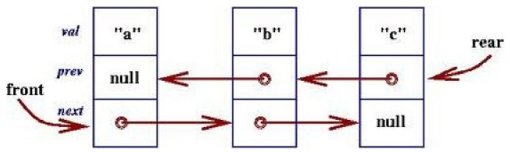
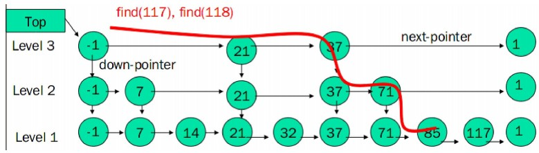
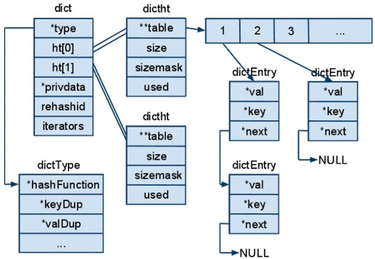

# 数据结构

徐顺 2014-4-6

Redis支持丰富的数据类型：二进制安全的字符串，列表，集合，有序集和哈希，并提供了一套丰富的API.
本节列出Redis核心的数据结构

## string(sds.h)

	// sds 类型
	typedef char *sds;

	// sdshdr 结构
	struct sdshdr { 
	    int len;  // buf 已占用长度 
	    int free;   // buf 剩余可用长度  
	    char buf[];  // 实际保存字符串数据的地方
	};

字符串是redis最基本的数据结构。Redis中的字符串分为两类，一类是二进制安全，一类是非二进制安全，其中value都是二进制安全，key为非二进制安全，二进制安全意味着可以存储任何字符。

`sdsnewlen(const void *init, size_t initlen)`，分配的字节数为`sizeof(struct sdshdr) + initlen + 1`.返回给用户的地址为sdhdr->buf.
通过`(s-(sizeof(struct sdshdr))`即可得到sdshdr的地址。

Redis这样设计使得仅暴露buf，应用程序可以将sds简单的当成char*使用，与char*相比，有这几点优势：O(1)计算字符串长度；高效执行Append操作；二进制安全。

	/*
	 * 返回 sds buf 的已占用长度
	 */
	static inline size_t sdslen(const sds s) {
	    struct sdshdr *sh = (void*)(s-(sizeof(struct sdshdr)));
	    return sh->len;
	}

	/*
	 * 返回 sds buf 的可用长度
	 */
	static inline size_t sdsavail(const sds s) {
	    struct sdshdr *sh = (void*)(s-(sizeof(struct sdshdr)));
	    return sh->free;
	}

## RedisObject(redis.h)

redisObject是Redis的核心，数据库的键，值及参数都可以表示为这种类型。

type表示字符串、列表、集合、有序集合和哈希表这五种类型。
encoding表示对象所保存的编码，即底层实现。
ptr执行具体的数据。

	/*
	 * Redis 对象
	 */
	typedef struct redisObject {
	    unsigned type:4;        // 类型   
	    unsigned notused:2;     // 不使用(对齐位)    
	    unsigned encoding:4;    // 编码方式    
	    unsigned lru:22;        // LRU 时间（相对于 server.lruclock）    
	    int refcount;           // 引用计数    
	    void *ptr;              // 指向对象的值
	} robj;

## LIST(t_list.c)

Redis列表使用两种数据结构作为其底层实现：压缩列表和双端链表。
顾名思义，压缩列表所用内存较低，所以优先使用它，只有在其需要的情况下，才转换成双端链表。

LIST (t_list.c)
– REDIS_LIST 类型, 如果其entry小于配置值listmax-ziplist-entries 或value字符串的长度小于listmax-ziplist-value，使用ziplist数据结构，否则使用标准的Doubly linked list

* (l/r)push, (l/r)pop, llen O(1)
* b(l/r)pop支持阻塞等待
* lrange/ltrim/lrem/lset/rpoplpush

## Ziplist (ziplist.c)

	/*
	 * 节点结构
	 */
	typedef struct zlentry {
	    unsigned int prevrawlensize,    // 保存前一节点的长度所需的长度 
	                 prevrawlen;        // 前一节点的长度
	    unsigned int lensize,           // 保存节点的长度所需的长度
	                 len;               // 节点的长度
	    unsigned int headersize;        // header 长度
	    unsigned char encoding;         // 编码方式
	    unsigned char *p;               // 内容
	} zlentry;

* O(mem_size) add/delete
* list-max-ziplist-entries (default: 1024)
* list-max-ziplist-value (default: 32)

Ziplist结构图

(图片来源于互联网)

## Doubly linked list (adlist.h)
链表作为数组的另一种选择，为其他高级语言所支持的基本数据类型，Redis实现了双端链表。
任何一本描述数据结构的书籍都少不了链表的表述，其原理简洁，实用性高，既是Redis列表的底层实现之一，也被Redis的内部模块所使用。

双端链表被应用于事务模块、服务器模块、订阅/发送模块等

	/*
	 * 链表节点
	 */
	typedef struct listNode {
	    struct listNode *prev;
	    struct listNode *next;
	    void *value;
	} listNode;

Redis为双端链表提供了迭代器，可以向前或者向后迭代。

	/*
	 * 链表迭代器
	 */
	typedef struct listIter {
	    listNode *next;
	    int direction;  // 迭代方向, 宏AL_START_HEADіൕཟభđAL_START_TAILіൕཟު
	} listIter;

	/*
	 * 链表
	 */
	typedef struct list { 
	    listNode *head;   // 表头指针 
	    listNode *tail;   // 表尾指针 
	    unsigned long len;  // 节点数量 
	    void *(*dup)(void *ptr);  // 复制函数 
	    void (*free)(void *ptr);  // 释放函数
	    int (*match)(void *ptr, void *key); // 比较函数
	} list;

listIter是访问链表的迭代器，指针next指向链表的下一个位置，direction表示迭代访问的方向。

(图片来源于互联网)

##  Skip List (t_zset.c)

(图片来源于互联网)

## dict (dict.h/dict.c)
字典在Redis中应用广泛，与SDS，双端链表一样是Redis最核心的数据结构之一。
Redis是一个KV数据库，数据库的底层实现就是基于字典。

Hashtable结构图

(图片来源于互联网)

Redis的哈希表能够自动扩容。非一次性进行扩容，而是渐进式的，以免耗时过大。
进行渐进式Rehash发生在如下阶段：dictFind, dictGetRandomKey, dictAddRaw, dictGenericDelete	

	/*
	 * 字典
	 *
	 * 每个字典使用两个哈希表，用于实现渐进式 rehash
	 */
	typedef struct dict { 
	    dictType *type;  // 特定于类型的处理函数
	    void *privdata;  // 类型处理函数的私有数据 
	    dictht ht[2];     // 哈希表的底层实现，ht[0]当前可用，ht[1]用于实现扩容，当扩容结束后，自动切换至ht[0]
	    int rehashidx;  // 记录 rehash 进度的标志，即待拷贝的桶索引，-1表示 rehash 未进行
	    int iterators;   // 当前正在运作的安全迭代器数量 
	} dict;

	/*
	 * 哈希表，Redis用开链法解决冲突
	 */
	typedef struct dictht {
	    dictEntry **table;       // 哈希表节点指针数组（俗称桶，bucket）
	    unsigned long size;      // 桶的大小
	    unsigned long sizemask;  // 掩码，用于计算索引值, sizemask = 2^size-1
	    unsigned long used;      // 哈希表现有的节点数量
	} dictht;

	/*
	 * 哈希表节点
	 */
	typedef struct dictEntry {
	    void *key;
	    union {
	        void *val;
	        uint64_t u64;
	        int64_t s64;
	    } v;
	    struct dictEntry *next; // 后继节点
	} dictEntry;

	/*
	 * 特定于类型的处理函数
	 */
	typedef struct dictType {
	    unsigned int (*hashFunction)(const void *key);      // 计算键的哈希值
	    void *(*keyDup)(void *privdata, const void *key);   // 拷贝键
	    void *(*valDup)(void *privdata, const void *obj);   // 拷贝值
	    int (*keyCompare)(void *privdata, const void *key1, const void *key2);  //键的比较
	    void (*keyDestructor)(void *privdata, void *key); // 释放键空间
	    void (*valDestructor)(void *privdata, void *obj); // 释放值空间
	} dictType;

	/*
	 * 字典迭代器
	 *
	 * 如果 safe 属性的值为 1 ，那么表示这个迭代器是一个安全迭代器。
	 * 当安全迭代器正在迭代一个字典时，该字典仍然可以调用 dictAdd 、 dictFind 和其他函数。
	 *
	 * 如果 safe 属性的值为 0 ，那么表示这不是一个安全迭代器。
	 * 如果正在运作的迭代器是不安全迭代器，那么它只可以对字典调用 dictNext 函数。
	 */
	typedef struct dictIterator {
	    dict *d;               // 正在迭代的字典 
	    int table,              // 正在迭代的哈希表的号码（0 或者 1）
	        index,              // 正在迭代的哈希表数组的索引
	        safe;               // 是否安全？
	    dictEntry *entry,       // 当前哈希节点
	              *nextEntry;   // 当前哈希节点的后继节点
	} dictIterator;

Hashtable的大小总为2的幂，最小为DICT_HT_INITIAL_SIZE(4). 

### Dict API 

	/* Expand or create the hash table */
	/*
	 *   扩展字典，可扩容或者收缩
	 *   1. 根据参数size计算hash表的长度，len=2^x, x=min{t|2^t>=size}
	 *   2. 若d->ht[0]为空，将新哈希表赋值给d->ht[0]
	 *   3. 若d->ht[0]不为空，那么将新哈希表赋值给d->ht[1] ，并置rehashidx=0，即需要rehash
	 */
	int dictExpand(dict *d, unsigned long size)

	/*
	 * 执行N步渐进式rehash，一次RehashN个桶
	 *
	 * 若哈希表中的所有元素都已迁移完毕，则返回0，否则返回1
	 */
	int dictRehash(dict *d, int n) 

	/* Expand the hash table if needed */
	/*
	 *  根据需要，对字典进行扩容，也即是对 ht[0] 进行 rehash
	 *  1. 若正在rehash直接返回
	 *  2. 若d->ht[0].used/size>=1 AND (dict_can_resize==1 OR used/size >= dict_force_resize_ratio), 
	 *     则进行2倍大小(d->ht[0].used*2)的扩容
	 */
	static int _dictExpandIfNeeded(dict *d)

	/*
	 * 返回key在哈希表中的索引, 如果 key 已存在哈希表中，则返回 -1 。
	 *
	 * 1. 看是否需要扩容
	 * 2. 计算key的哈希值
	 * 3. 根据掩码定位到具体的桶索引idx, 遍历d->ht[i].table[idx]链表，进行key比较，
	      如果存在则返回-1，否则返回idx位置。若不在rehash，i=0, 否则i=0,1
	 */
	static int _dictKeyIndex(dict *d, const void *key)

	/*
	 * 销毁给定哈希表，并释放空间
	 */
	int _dictClear(dict *d, dictht *ht)

	/*
	 * 在字典中查找给定 key 所定义的节点，如果 key 不存在，返回 NULL
	 * 代码逻辑与_dictKeyIndex相似
	 */
	dictEntry *dictFind(dict *d, const void *key)

	/*
	 * 返回在字典中， key 所对应的值 value, 如果key不存在于字典，那么返回 NULL
	 * 通过调用dictFind实现
	 */
	void *dictFetchValue(dict *d, const void *key) 

	/*
	 * 根据给定字典，创建一个不安全迭代器。
	 */
	dictIterator *dictGetIterator(dict *d)

	/*
	 * 迭代下一个节点，如果字典已经迭代完毕，则返回 NULL 。
	 */
	dictEntry *dictNext(dictIterator *iter)

## 事件结构体

aeFileEvent可用于对socket的监听，mask代表监听类型。当事件触发后，调用相应的读写事件处理函数进行响应。

	/*
	 *
	 * 文件事件结构体
	 */
	typedef struct aeFileEvent {
	    int mask;   /* one of AE_(READABLE|WRITABLE) */  // 掩码， 文件事件类型: 读，写 ， 读|写
	    aeFileProc *rfileProc;  // 读事件函数 
	    aeFileProc *wfileProc;  // 写事件函数
	    void *clientData; // 多路复用库的私有数据
	} aeFileEvent;

	
aeTimeEvent用于定时事件， when_sec和when_ms组成事件的触发时间。时间事件集合由链表构成。
可以通过更新时间事件的when_sec和when_ms将事件当成循环定时事件。

	/* 
	 *
	 * 时间事件结构体
	 */
	typedef struct aeTimeEvent {
	    long long id;  // 标识符 
	    // 事件的触发时间
	    long when_sec;  /* seconds */
	    long when_ms;   /* milliseconds */
	    aeTimeProc *timeProc; // 事件处理函数
	    aeEventFinalizerProc *finalizerProc; // 事件释放函数， 当事件删除后执行
	    void *clientData; // 多路复用库的私有数据
	    struct aeTimeEvent *next; // 指向下个时间事件结构，形成链表
	} aeTimeEvent;

	/* 
	 *
	 * 已就绪事件
	 */
	typedef struct aeFiredEvent {
	    int fd; // 文件描述符 
	    int mask; // 事件类型掩码
	} aeFiredEvent;

aeEventLoop事件处理模型中最核心的结构体，保存了所有的事件。

	/* State of an event based program 
	 *
	 * 事件处理器的状态
	 */
	typedef struct aeEventLoop {
	    int maxfd;   /* 当前已注册的最大文件描述符 */
	    int setsize; /* 当前已追踪的最大描述符 */
	    long long timeEventNextId; // 下一次时间事件 id
	    time_t lastTime;     // 最后一次执行时间事件的时间， Used to detect system clock skew 
	    aeFileEvent *events; // 已注册的文件事件
	    aeFiredEvent *fired;  // 已就绪的文件事件
	    aeTimeEvent *timeEventHead; // 时间事件， 以链表形式组织 
	    int stop;                  // 事件轮询开关，若为1，则停止时间轮询
	    void *apidata; /* This is used for polling API specific data */   // 多路复用库的私有数据
	    aeBeforeSleepProc *beforesleep;   // 每次事件轮询前，调用的函数，相当于hook
	} aeEventLoop;

### Redis Command结构体

	struct redisCommand {
	    char *name;              // Redis命令名字
	    redisCommandProc *proc;  // 命令的处理函数
	    int arity;               // 命令所需的参数个数，-N 表示参数个数 >= N
	    char *sflags;            // 字符形式表示的 FLAG 值, 一个字符表示一个Flag
	    int flags;               // 实际的 FLAG 值，由 sflags 计算得出
	    redisGetKeysProc *getkeys_proc; // 可选函数，用于决定参数个数，Used for Redis Cluster redirect 
	    int firstkey;           // 第一个 key 的位置， 0表示没有key
	    int lastkey;            // 最后一个 key 的位置
	    int keystep;            // 两个 key 之间的包含的步数
	    long long microseconds; // 执行命令所花费的总毫秒数， 用于统计。
	    long long calls;        // 命令被调用的总次数
	};

