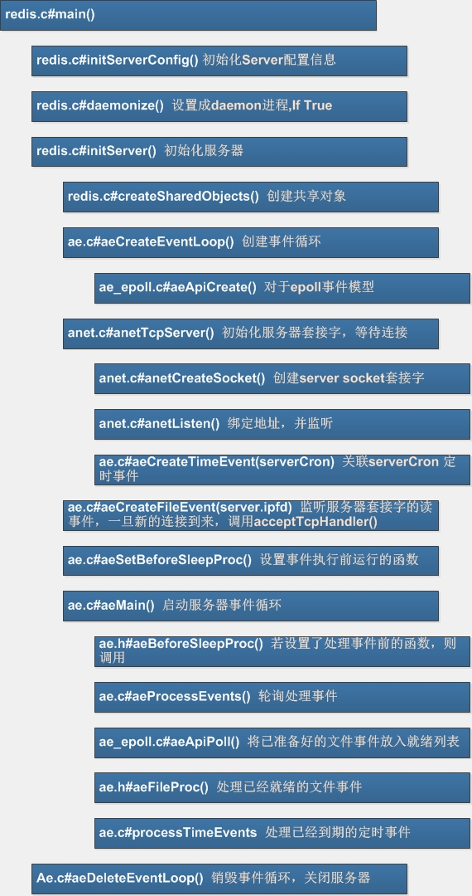
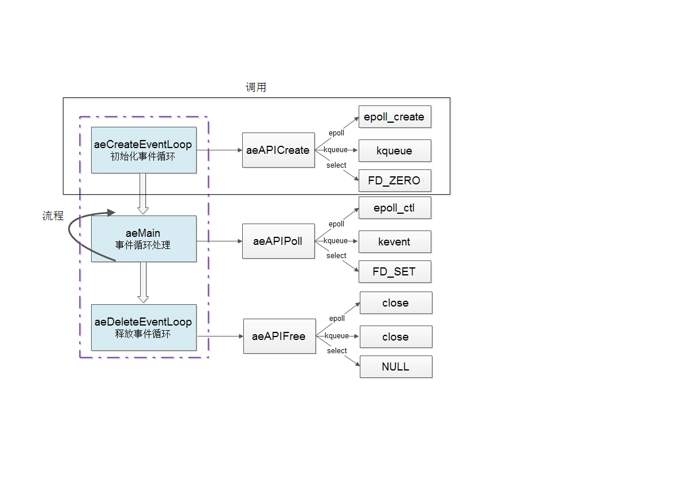
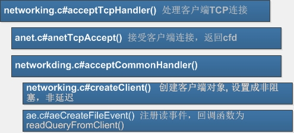
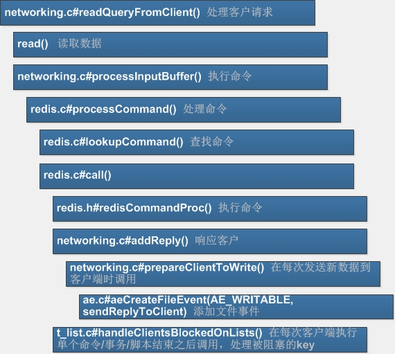

# Redis 工作流程解析

徐顺 2014-4-2

## Redis启动和服务流程

在redis.c的main函数，主要做三件事情：

* 加载配置: 包括从命令行或者传入配置文件.
* 启动TCP监听，客户端的列表保存在redisserver的clients中
* 启动AE Event Loop事件，异步处理客户请求。

启动完成，AE会定时间去查询各个客户端是否有输入，如果有读取客户端输入并且对命令进行解析，命令信息保存在Hash表中。

(图片用Visio设计，缩进代表调用关系)

* initServerConfig()
设定默认的参数值，并读取配置文件redis.conf，若用户配置了某个参数，则用该参数值替换默认值。  

* initServer();
该函数主要对server进行初始化，初始化内容包括：
调用anetTcpServer()函数创建socket server作为redis server，并将该server的句柄加到epoll/kqueue的监听队列中。
一旦有client接入，便会对该client触发操作acceptTcpHandler，该操作是调用aeCreateFileEvent注册的。

* anetTcpServer()为建立网络套接字服务器的方法，对socket(), bind()和listen()等函数进行了封装。

* aeMain(aeEventLoop *eventLoop)是启动事件轮询的入口，内部实现为一循环，不断处理来自客户的请求。

事件处理器的主循环

    void aeMain(aeEventLoop *eventLoop) {
        eventLoop->stop = 0;
        while (!eventLoop->stop) {
            // 如果有需要在事件处理前执行的函数，那么运行它
            if (eventLoop->beforesleep != NULL)
                eventLoop->beforesleep(eventLoop);
            aeProcessEvents(eventLoop, AE_ALL_EVENTS);   // 开始处理事件
        }
    }

事件处理框架非常简单，从初始化、服务到结束，分别对应的函数:aeCreateEventLoop、aeMain、aeDeleteEventLoop
其中，aeMain是事件循环的主体函数，它又会调用 aeProcessEvents函数，三个主体函数会调用aeApiCreate、aeApiPool、aeApiFree三个接口函数进行处理。
这三个接口函数又会映射到具体的某一种网络模型中。
具体如下图所示：

添加事件和删除事件的具体实现，也与相应的网络模型相对应。

处理事件循环
aeMain函数调用aeProcessEvent函数，在一个循环中处理文件事件和到期的时间事件。
aeProcessEvents函数调用aeSearchNearestTimer函数来查询事件循环中最先要过期的事件，时间复杂度为O(N)。先处理文件事件，然后再处理时间事件。

## 接受客户端TCP连接流程

acceptTcpHandler()该函数会调用acceptCommonHander()，而acceptCommonHander()又会调用createClient()来为该client创建一个redisClient对象，最终，redis会根据用户输入的命令通过查找命令表调用已经写好的命令执行函数。

用户输入get命令，redis最终会调用getCommand函数，用户输入set命令，redis最终会调用setCommand函数。

redis执行完用户的一个命令后，会将结果写入到redisClient对象中的reply list中，而sendReplyToClient函数会不断的从该list中数据，异步地发送给client。需要注意的是，sendReplyToClient函数也是通过aeCreateFileEvent注册的。

## 处理客户请求流程

通过processInputBuffer()来解析querybuf, 若c->querybuf存在多条命令，则依次解析并处理这些命令。

* 如果是telnet发送的裸协议数据是没有*打头的表示参数个数的辅助信息，用processInlineBuffer()函数解析输入，
* 其他则通过processMultibulkBuffer()函数解析。
* 若解析函数返回REDIS_ERR，则等待下一次read()，是因为客户端缓存数据还没构成一条命令即不满足Redis协议格式；否则返回REDIS_OK, 处理命令。

## 响应客户

### 数据读取
调用系统函数read来读取客户端传送过来的数据，
调用read后对读取过程中所遇到的情况：

* 系统中断(nread == -1 && errno == EAGAIN)
* 读取出错(nread == -1 && errno != EAGAIN) freeClient()
* 客户端关闭(nread == 0) freeClient()
* 超过读取数据限制(1GB)则报错。
读取完后进入processInputBuffer进行协议解析。

### 数据解析
从readQueryFromClient()函数读取客户端传过来的数据，进入processInputBuffer()函数进行协议解析，可以把processInputBuffer函数看作是输入数据的协议解析器

Redis支持两种协议，一种是inline，一种是multibulk。inline协议是老协议，现在一般只在命令行下的redis客户端使用，其他情况一般是使用multibulk协议。

如果客户端传送的数据的第一个字符时‘*’，那么传送数据将被当做multibulk协议处理，否则将被当做inline协议处理。Inline协议的具体解析函数是processInlineBuffer()，multibulk协议的具体解析函数是processMultibulkBuffer()。
当协议解析完毕，即客户端传送的数据已经解析出命令字段和参数字段，接下来进行命令处理，命令处理函数是processCommand。

### 发送数据
通过调用系统函数write给客户端发送数据，如果缓冲区有数据就把缓冲区的数据发送给客户端，缓冲区的数据发送完了，如果有排队数据，则继续发送。

* 发送缓冲区(c->buf)的内容
* 发送回复链表(c->reply)的内容

### 写入异常处理：
* 被系统中断(nwritten == -1 && errno == EAGAIN)
* 写数据出错(nwritten == -1 && errno != EAGAIN)，释放客户端freeClient()

