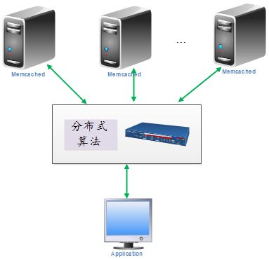
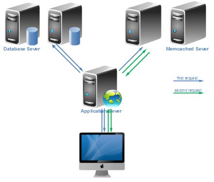

# Memcached简介

徐顺 2013-08-12

## Memcached概述

Memcached 是一个高性能的分布式内存对象缓存系统，用于动态 Web 应用以减轻数据库负载。它通过在内存中缓存数据和对象来减少读取数据库的次数，从而提高动态、数据库驱动网站的速度。

## Memcached特征

* C/S架构
* 分布式
* 多协议支持
    * 基于文本行的协议
    * 二进制协议(1.3起)
* 基于[libevent](http://libevent.org/)的事件处理
    * 轻量级网络框架
    * 支持多平台I/O多路复用技术：epoll,kqueue,dev/poll,select
    * 事件驱动
    * 支持网络I/O、定时器和信号等事件
* slab内存管理
* 多线程：主从(Master-Worker)线程机制

## Memcached用户

* LiveJournal/Wikipedia/Flickr
* Twitter/Youtube/Digg
* WordPress.com/Craigslist/Mixi
* 百度/58同城

## Memcached分布式

Memcached的分布式是通过客户端的程序库来实现的。可用算法有静态哈希算法和一致性哈希算法等。

Memcached的分布式算法将不同的键保存到不同的服务器上。在分布式环境中，当某一台Memcached服务器发生故障无法连接时，只有分布到这台服务器上的key/values对不能访问，其他key/value对不受影响。

## Memcached请求流程

上图中，蓝线代表程序第一次请求查询数据过程，绿线代表第二次请求数据过程。

* 假如数据库中有如此映射，"song" => "You'll never walk alone"
* 第一次请求查询"song"关联的value时，由于Memcached没有相应数据，程序转而请求查询数据库，根据返回的结果提取value值，然后把键/值对存储到Memcached中
* 在后续处理中，程序又要从检索与"song"相关的value值，因Memcached已经有相应数据，可直接返回，而不需要查询数据库，当命中率高的时候，能明显的提高响应时间。

### 参考资料

关于Memcached的一系列文章参考的主要资料如下，以后的文档将不一一列出，非常感谢他们为Memcached研究所做的贡献，使得我们能更快的上手和理解。由于很多资料无法找到原始出处，本文将只列出其名字，可以通过google找到相关资料。

[1]孙玄：Inside Memcached@孙玄musicml.pdf  
[2]Xguru：[Memcached源码剖析笔记.pdf](http://www.cppblog.com/xguru/archive/2013/04/22/106265.html)  
[3]刘中兵：Memcached内存分析、调优、集群.pptx  
[4]长野雅广、前坂徹：memcached全面剖析.pdf  
[5]Memcached深度分析.pdf  
[6]heiyeluren：Memcached原理和使用详解.pdf  
[7]谭洪林：Memcached源代码分析.pdf  
