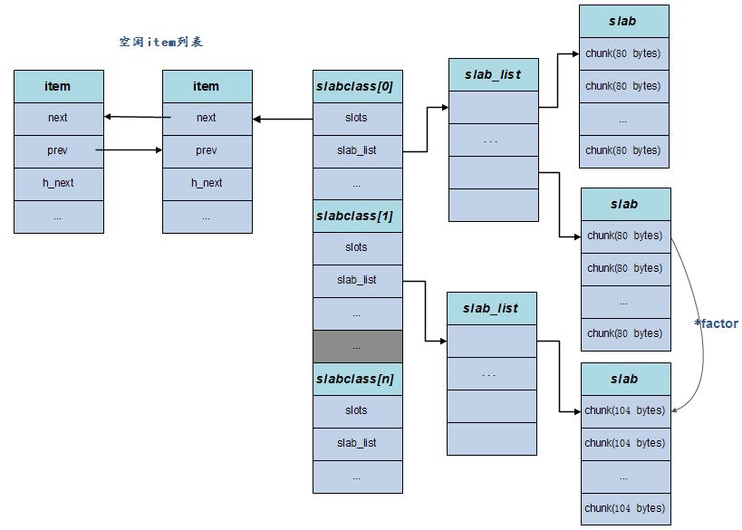

# Memcached内存管理
徐顺 2013-08-21

## Memcached内存分配原理
Memcached采用的是Slab内存分配机制管理内存。它的基本原理是按照预先分配的大内存分成大小相等的slab(默认为1M)，每个slab又分割成多个相同尺寸的块(chunk)，并把尺寸相同的块组成slabclass，以提高内存请求分配效率和解决内存碎片问题。

### slab
slab 源于Jeff Bonwick 为`Solaris`操作系统首次引入的一种内存处理机制，SLAB的设计理念是基于对象缓冲的，基本想法是避免重复大量的初始化和清理操作。slab主要可以用于频繁分配释放的内存对象，如果是采用系统自带的`malloc/free`系列函数， 反复地操作会造成大量内存碎片，且时间效率不高。

## 内存管理机制  

* 内存分配机制：Slab Allocation
    * 内存预分配，组织成不同尺寸的块，以适应不同大小的内存请求
    * 避免大量的内存分配与释放(mallock,free)
    * 减少内存碎片
* 数据过期机制：Lazy Expiration + LRU 
    * 不检查item对象是否超时，等待get时再行判断
    * 删除对象时，不释放内存，将内存放入相应的空闲链表中
    * 对象替换策略采用LRU算法
* 检索机制：Hash
    * 提高检索效率

## 核心数据结构

### 基本概念
* slabclass: Memcached存在一个slabclass集合，每个slabclass提供固定大小的内存(chunk)分配，不同slabclass对外分配的内存大小也不一样。初始化的时候，会根据factor确定每个slabclass所要分配的内存大小。
* Item：存储项，存储一个具体的key-value结构，其空间来源于chunk。
* chunk : 实际用来存储数据的内存空间，chunk就是属于某个slabclass分配出去的固定大小内存。
* slab：一次申请内存的最小单位，默认是1MB，当一个slabclass没有内存可用时，需要向系统申请新的空间，这时候都是依照一
个slab的大小来申请的。当一个slab可用的chunk分配完后，可继续申请新的slab使用，若slab申请失败(mem_limit所限制)，则slab Allocator管理机制通过LRU算法选择最近最小使用且合适的chunk返回，以存储新的数据。

Memcached预先将数据空间划分为一系列大小的slabclass，每个slabclass只负责一定大小范围内的数据存储， 即slabclass只存储大于其上一个slabclass中chunk的size并小于或者等于自己最大size的数据。

Memcached根据所收到数据的大小，选择最适合数据大小的slabclass，然后从空闲chunk列表取出一个chunk， 然后将数据缓存于其中。

slab是Memcached在收到内存不够的请求，并进行内存分配的单位。举例来说，slabclass[2]中所有的chunk空间都用完了，系统又要在slabclass[2]中申请一个chunk，这时就会向Memcached请求新的内存空间，Memcached就会f分配一个slab到slabclass[2]，slab的默认大小是1M。 chunk是实际用来存储数据的内存空间。一个slab大小的内存可分割成 slab / chunksize 个chunk。

### slabclass结构体

	typedef struct {
	    unsigned int size;       /* item的大小 */
	    unsigned int perslab;    /* 每一个slab的item数量 */

	    void *slots;             /* 空闲item(被回收的item)链表的指针 */
	    unsigned int sl_curr;    /* 空闲item的总数量 */

	    unsigned int slabs;     /* 在这个slabclass中已分配slab的数量 */

	    void **slab_list;       /* slab数组 */
	    unsigned int list_size; /* 数组的大小 */

	    unsigned int killing;   /* index+1 of dying slab, or zero if none */
	    size_t requested;       /* 被访问到的字节数 */
	} slabclass_t;

### item结构体

	/**
	 * Memcached存储item的结构体
	 */
	typedef struct _stritem {
	    struct _stritem *next;       /* 双向链表 */
	    struct _stritem *prev;
	    struct _stritem *h_next;    /* 指向hash值相同的下一个元素 */
	    rel_time_t      time;       /* 最近访问的时间 */
	    rel_time_t      exptime;    /* 过期时间 */
	    int             nbytes;     /* 数据大小 */
	    unsigned short  refcount;   /* 被引用数 */
	    uint8_t         nsuffix;    /* 后缀长度 */
	    uint8_t         it_flags;   /* ITEM_* above */
	    uint8_t         slabs_clsid;/* 此item所属哪个slabclass */
	    uint8_t         nkey;       /* 键的长度　*/
	    /* this odd type prevents type-punning issues when we do
	     * the little shuffle to save space when not using CAS. */
	    union {
	        uint64_t cas;
	        char end;
	    } data[];
	    /* if it_flags & ITEM_CAS we have 8 bytes CAS */
	    /* then null-terminated key */
	    /* then " flags length\r\n" (no terminating null) */
	    /* then data with terminating \r\n (no terminating null; it's binary!) */
	} item;

## slab.c核心代码解析

### 初始化slabclass
	/**
	 * 初始化slabclass数组
	 *
	 * 1. 若预分配(preallock = true)，则分配一大段内存limit，并初始化
	 * 2. 初始化slabclass数组
	 *    包括块大小(size: item结构体+数据)，每个slab能包含多少个块(perslab)，所分配的chunk是字节对齐的
	 *    默认的slab大小为1M， slab >= size * perslab. 所以每个slab中可能存在尾部碎片
	 * 3. 若预分配，slab初始化， 具体看slabs_preallocate()的分析
	 * 
	 * limit等价于 –m指定的内存分配最大值，factor等价于-f参数， preallocate等价于-L参数
	 * 如果设置了-L参数，则尝试一次性申请maxbytes大小的内存，指针保存到全局的mem_base变量里，未来所有内存申请实际上是从这块内存区域中分配的
	 */
	void slabs_init(const size_t limit, const double factor, const bool prealloc) {
	    int i = POWER_SMALLEST - 1;  // POWER_SMALLEST ： slabclass数组的最小下标, 默认为1
	    unsigned int size = sizeof(item) + settings.chunk_size;

	    mem_limit = limit;

	    if (prealloc) {
	        /* 用malloc分配一块大内存 */
	        mem_base = malloc(mem_limit);
	        if (mem_base != NULL) {
	            mem_current = mem_base;
	            mem_avail = mem_limit;
	        } else {
	            fprintf(stderr, "Warning: Failed to allocate requested memory in"
	                    " one large chunk.\nWill allocate in smaller chunks\n");
	        }
	    }

	    memset(slabclass, 0, sizeof(slabclass));

	    while (++i < POWER_LARGEST && size <= settings.item_size_max / factor) {
	        /* Make sure items are always n-byte aligned */
	        if (size % CHUNK_ALIGN_BYTES)
	            size += CHUNK_ALIGN_BYTES - (size % CHUNK_ALIGN_BYTES);  //字节对齐

	        slabclass[i].size = size;
	        slabclass[i].perslab = settings.item_size_max / slabclass[i].size;
	        size *= factor;
	        if (settings.verbose > 1) {
	            fprintf(stderr, "slab class %3d: chunk size %9u perslab %7u\n",
	                    i, slabclass[i].size, slabclass[i].perslab);
	        }
	    }

	    power_largest = i;
	    slabclass[power_largest].size = settings.item_size_max;
	    slabclass[power_largest].perslab = 1;
	    if (settings.verbose > 1) {
	        fprintf(stderr, "slab class %3d: chunk size %9u perslab %7u\n",
	                i, slabclass[i].size, slabclass[i].perslab);
	    }

	    /* for the test suite:  faking of how much we've already malloc'd */
	    {
	        char *t_initial_malloc = getenv("T_MEMD_INITIAL_MALLOC");
	        if (t_initial_malloc) {
	            mem_malloced =
	             (size_t)atol(t_initial_malloc);
	        }

	    }

	    if (prealloc) {
	    	/**
             * m = min(maxslabs, POWER_LARGEST)
             * 为slabclass[POWER_SMALLEST.. m]数组的每一项分配一个slab的空间，并划分成chunk
             */
	        slabs_preallocate(power_largest);
	    }
	}

#### 确认slabclassID

对于不同大小的数据，首先要确定这些数据需要在哪个slabclass里存放，轮询每个slabclass的chunk，返回此slabclass的id

	/**
	 * 给定一个对象大小的字节数，返回容纳该对象的chunk属于哪个slabclass
	 *
	 */
	unsigned int slabs_clsid(const size_t size) {
	    int res = POWER_SMALLEST;

	    if (size == 0)
	        return 0;
	    while (size > slabclass[res].size)
	        if (res++ == power_largest)     /* won't fit in the biggest slab */
	            return 0;
	    return res;
	}

Memcached分配内存的好处是不会存在内存碎片，但是坏处也很明显，就是内存的浪费。如：slabclass[1]中的chunk大小为80字节，slabclass[2]中的chunk大小为104字节，对于需要请求81字节的chunk，则会浪费23字节的空间。

### 申请chunk
内存申请过程涉及到两个函数，一个函数用于申请新的slab page，一个函数用于从slabclass里分配空闲的chunk，
当无法从do_slabs_newslab()中分配出新的空间，导致do_slabs_alloc()也只能返回NULL的时候，Memcached进行LRU淘汰。

	/**
	 * 在slabclass[id]中，分配一个size大小的item。失败返回0，成功返回item的地址
	 *
	 * 1. id校验
	 * 2. 若slabclass[id]中没有空闲的item，则请求分配一个新的slab，若请求失败，则返回0
	 * 3. 返回slots链表中的第一个元素，slabclass[id]的空闲item数减一
	 */
	static void *do_slabs_alloc(const size_t size, unsigned int id) {
	    slabclass_t *p;
	    void *ret = NULL;
	    item *it = NULL;

	    // id校验
	    if (id < POWER_SMALLEST || id > power_largest) {
	        MEMCACHED_SLABS_ALLOCATE_FAILED(size, 0);
	        return NULL;
	    }

	    p = &slabclass[id];
	    /* 当前slabclass[id]的可用chunk数为0， 或者slots的第一个元素的slabclass Id为0 
	     * 不太理解后者，slabclass id为0表示无效啊，那什么情况下又是赋予0的？
	     */
	    assert(p->sl_curr == 0 || ((item *)p->slots)->slabs_clsid == 0);

	    /* fail unless we have space at the end of a recently allocated page,
	       we have something on our freelist, or we could allocate a new page */
	    if (! (p->sl_curr != 0 || do_slabs_newslab(id) != 0)) {
	        /* We don't have more memory available */
	        ret = NULL;
	    } else if (p->sl_curr != 0) {
	        /* return off our freelist */
	        it = (item *)p->slots;
	        p->slots = it->next;
	        if (it->next) it->next->prev = 0;
	        p->sl_curr--;
	        ret = (void *)it;
	    }

	    if (ret) {
	        p->requested += size;
	        MEMCACHED_SLABS_ALLOCATE(size, id, p->size, ret);
	    } else {
	        MEMCACHED_SLABS_ALLOCATE_FAILED(size, id);
	    }

	    return ret;
	}

		/**
	 * 为slabclass[id]分配一个新的slab，成功返回1，否则返回0
	 * 
	 * 1. 确定slab的长度len
	 * 2. 分配len大小的内存(预分配的内存中划分或者调malloc()分配)
	 * 3. 把所分配的内存初始化成item链表，链接到slabclass[id]的slot中
	 * 4. slabclass[i]属性的更新：slabs数增1
	 * 5. 已分配内存数的更新
	 */
	static int do_slabs_newslab(const unsigned int id) {
	    slabclass_t *p = &slabclass[id];
	    int len = settings.slab_reassign ? settings.item_size_max
	        : p->size * p->perslab;
	    char *ptr;

	    if ((mem_limit && mem_malloced + len > mem_limit && p->slabs > 0) ||
	        (grow_slab_list(id) == 0) ||
	        ((ptr = memory_allocate((size_t)len)) == 0)) {

	        MEMCACHED_SLABS_SLABCLASS_ALLOCATE_FAILED(id);
	        return 0;
	    }

	    memset(ptr, 0, (size_t)len);
	    split_slab_page_into_freelist(ptr, id);

	    p->slab_list[p->slabs++] = ptr;
	    mem_malloced += len;
	    MEMCACHED_SLABS_SLABCLASS_ALLOCATE(id);

	    return 1;
	}

### 线程安全 
 Memcached中slabs_alloc()函数是do_slabs_alloc()函数线程安全版本。

	/** 线程安全的do_slabs_alloc() */
	void *slabs_alloc(size_t size, unsigned int id) {
	    void *ret;

	    pthread_mutex_lock(&slabs_lock);
	    ret = do_slabs_alloc(size, id);
	    pthread_mutex_unlock(&slabs_lock);
	    return ret;
	}
相应地，do_slabs_free/stats等函数也有相应的线程安全版本

#### LRU

Memcached内部不会监视记录是否过期，而是在get时查看记录的时间戳，检查记录是否过期。 这种技术被称为lazy（惰性）expiration，因此，memcached不会在过期对象监视上耗费CPU时间。如果某一个item在Memcached里过期了，这个东西并不会被删除，而是客户端无法再看见该记录（invisible，透明）， 其存储空间即可重复使用。一般情况下Memcached会优先使用已超时的记录的空间，但即使如此，也会发生追加新记录时空间不足的情况， 此时就要使用名为 Least Recently Used（LRU）机制来分配空间，从最近未被使用的记录中搜索，并将其空间分配给新的记录。

当无法从现有chunk中找到过期内容同时无法从class里继续分配新的chunk，这时候尝试LRU过程，先删过期内容，如果还无法分配，就开始删最近的内容。

* 每个slabclass对应一个item的双向链表，队头指向最近被访问的元素，队尾指向最老的元素。
* 当新的内存分配请求到来，且没有可用的slab可供分配时，触发LRU策略。

### 释放资源  
无论是通过LRU策略还是通过其它主动淘汰策略，都需要标记refcount = 0（引用计数），然后才会通过do_slabs_free()释放资源，等待其它资源申请的时候使用。

	/**
	 * 将ptr所指向的item链入slabclass[id]的slot链表中
	 *
	 */
	static void do_slabs_free(void *ptr, const size_t size, unsigned int id) {
	    slabclass_t *p;
	    item *it;

	    assert(((item *)ptr)->slabs_clsid == 0);
	    assert(id >= POWER_SMALLEST && id <= power_largest);
	    if (id < POWER_SMALLEST || id > power_largest)
	        return;

	    MEMCACHED_SLABS_FREE(size, id, ptr);
	    p = &slabclass[id];

	    it = (item *)ptr;
	    it->it_flags |= ITEM_SLABBED;  // 设置item的标志
	    it->prev = 0;
	    it->next = p->slots;
	    if (it->next) it->next->prev = it;
	    p->slots = it;

	    p->sl_curr++;  // chunk可用数增1
	    p->requested -= size;
	    return;
	}

## item.c核心代码解析

### item空间分配

	/**
	 * 根据item参数，分配item空间
	 *
	 * 1. 计算item所需空间大小
	 * 2. 计算此item属于哪个slabclass id
	 * 3. 快速检查在slabclass[id]所属的LRU队列中(从尾端开始)是否有过期的item
	 * 4. 对item初始化：item结构体属性，key，suffix，不包含value
	 */
	item *do_item_alloc(char *key, const size_t nkey, const int flags,
	                    const rel_time_t exptime, const int nbytes,
	                    const uint32_t cur_hv) {
	    uint8_t nsuffix;
	    item *it = NULL;
	    char suffix[40];
	    size_t ntotal = item_make_header(nkey + 1, flags, nbytes, suffix, &nsuffix);
	    if (settings.use_cas) {
	        ntotal += sizeof(uint64_t);
	    }

	    unsigned int id = slabs_clsid(ntotal);
	    if (id == 0)
	        return 0;

	    mutex_lock(&cache_lock);
	    /* do a quick check if we have any expired items in the tail.. */
	    int tries = 5;
	    int tried_alloc = 0;
	    item *search;
	    void *hold_lock = NULL;
	    rel_time_t oldest_live = settings.oldest_live;

	    search = tails[id];
	    /* We walk up *only* for locked items. Never searching for expired.
	     * Waste of CPU for almost all deployments */
	    /*
	     * 只搜索加锁的item项，而不搜索过期的item，因为那样会浪费很多CPU时间
	     */
	    for (; tries > 0 && search != NULL; tries--, search=search->prev) {
	        uint32_t hv = hash(ITEM_key(search), search->nkey, 0);
	        /* Attempt to hash item lock the "search" item. If locked, no
	         * other callers can incr the refcount
	         */
	        /* FIXME: I think we need to mask the hv here for comparison? */
	        if (hv != cur_hv && (hold_lock = item_trylock(hv)) == NULL)
	            continue;
	        /* Now see if the item is refcount locked */
	        if (refcount_incr(&search->refcount) != 2) {
	            refcount_decr(&search->refcount);
	            /* Old rare bug could cause a refcount leak. We haven't seen
	             * it in years, but we leave this code in to prevent failures
	             * just in case */
	            if (search->time + TAIL_REPAIR_TIME < current_time) {
	                itemstats[id].tailrepairs++;
	                search->refcount = 1;
	                do_item_unlink_nolock(search, hv);
	            }
	            if (hold_lock)
	                item_trylock_unlock(hold_lock);
	            continue;
	        }

	        /* Expired or flushed */
	        if ((search->exptime != 0 && search->exptime < current_time)
	            || (search->time <= oldest_live && oldest_live <= current_time)) {
	            itemstats[id].reclaimed++;
	            if ((search->it_flags & ITEM_FETCHED) == 0) {
	                itemstats[id].expired_unfetched++;
	            }
	            it = search;
	            slabs_adjust_mem_requested(it->slabs_clsid, ITEM_ntotal(it), ntotal);
	            do_item_unlink_nolock(it, hv);
	            /* Initialize the item block: */
	            it->slabs_clsid = 0;
	        } else if ((it = slabs_alloc(ntotal, id)) == NULL) {
	            tried_alloc = 1;
	            if (settings.evict_to_free == 0) {
	                itemstats[id].outofmemory++;
	            } else {
	                itemstats[id].evicted++;
	                itemstats[id].evicted_time = current_time - search->time;
	                if (search->exptime != 0)
	                    itemstats[id].evicted_nonzero++;
	                if ((search->it_flags & ITEM_FETCHED) == 0) {
	                    itemstats[id].evicted_unfetched++;
	                }
	                it = search;
	                slabs_adjust_mem_requested(it->slabs_clsid, ITEM_ntotal(it), ntotal);
	                do_item_unlink_nolock(it, hv);
	                /* Initialize the item block: */
	                it->slabs_clsid = 0;

	                /* If we've just evicted an item, and the automover is set to
	                 * angry bird mode, attempt to rip memory into this slab class.
	                 * TODO: Move valid object detection into a function, and on a
	                 * "successful" memory pull, look behind and see if the next alloc
	                 * would be an eviction. Then kick off the slab mover before the
	                 * eviction happens.
	                 */
	                if (settings.slab_automove == 2)
	                    slabs_reassign(-1, id);
	            }
	        }

	        refcount_decr(&search->refcount);
	        /* If hash values were equal, we don't grab a second lock */
	        if (hold_lock)
	            item_trylock_unlock(hold_lock);
	        break;
	    }

	    if (!tried_alloc && (tries == 0 || search == NULL))
	        it = slabs_alloc(ntotal, id);

	    if (it == NULL) {
	        itemstats[id].outofmemory++;
	        mutex_unlock(&cache_lock);
	        return NULL;
	    }

	    assert(it->slabs_clsid == 0);
	    assert(it != heads[id]);

	    /* Item initialization can happen outside of the lock; the item's already
	     * been removed from the slab LRU.
	     */
	    it->refcount = 1;     /* the caller will have a reference */
	    mutex_unlock(&cache_lock);
	    it->next = it->prev = it->h_next = 0;
	    it->slabs_clsid = id;

	    DEBUG_REFCNT(it, '*');
	    it->it_flags = settings.use_cas ? ITEM_CAS : 0;
	    it->nkey = nkey;
	    it->nbytes = nbytes;
	    memcpy(ITEM_key(it), key, nkey);
	    it->exptime = exptime;
	    memcpy(ITEM_suffix(it), suffix, (size_t)nsuffix);
	    it->nsuffix = nsuffix;
	    return it;
	}

### item更新与替换

	/**
	 * 更新item的时间，若item的时间相对于在当前时间的ITEM_UPDATE_INTERVAL范围之内，则不修改(效率的考虑)
	 */
	void do_item_update(item *it) {
	    MEMCACHED_ITEM_UPDATE(ITEM_key(it), it->nkey, it->nbytes);
	    if (it->time < current_time - ITEM_UPDATE_INTERVAL) {
	        assert((it->it_flags & ITEM_SLABBED) == 0);

	        mutex_lock(&cache_lock);
	        if ((it->it_flags & ITEM_LINKED) != 0) {
	            item_unlink_q(it);
	            it->time = current_time;
	            item_link_q(it);
	        }
	        mutex_unlock(&cache_lock);
	    }
	}

	/**
	 * 用new_it替换it
	 * 这两个item的hashvalue相同？
	 */
	int do_item_replace(item *it, item *new_it, const uint32_t hv) {
	    MEMCACHED_ITEM_REPLACE(ITEM_key(it), it->nkey, it->nbytes,
	                           ITEM_key(new_it), new_it->nkey, new_it->nbytes);
	    assert((it->it_flags & ITEM_SLABBED) == 0);

	    do_item_unlink(it, hv);
	    return do_item_link(new_it, hv);
	}

### item空间释放
	/**
	 *
	 * 将item放入slabclass[id]的slot链表中
	 *
	 * 1. item属性校验
	 * 2. item的slabs_clsid属性修改
	 * 3. item空间“释放”
	 */
	void item_free(item *it) {
	    size_t ntotal = ITEM_ntotal(it);
	    unsigned int clsid;
	    assert((it->it_flags & ITEM_LINKED) == 0);
	    assert(it != heads[it->slabs_clsid]);
	    assert(it != tails[it->slabs_clsid]);
	    assert(it->refcount == 0);

	    /* so slab size changer can tell later if item is already free or not */
	    clsid = it->slabs_clsid;
	    it->slabs_clsid = 0;
	    DEBUG_REFCNT(it, 'F');
	    slabs_free(it, ntotal, clsid);
	}

	/**
	 * 如果item没有在其他地方引用，则把它归还到特定的slabclass中
	 */
	void do_item_remove(item *it) {
	    MEMCACHED_ITEM_REMOVE(ITEM_key(it), it->nkey, it->nbytes);
	    assert((it->it_flags & ITEM_SLABBED) == 0);  // ITEM_SLABBED已经被删除后被标记。

	    if (refcount_decr(&it->refcount) == 0) {
	        item_free(it);
	    }
	}

### item的LRU队列和Hash

	/**
	 * 将item添加至它所属LRU链表的头部
	 */
	static void item_link_q(item *it) { /* item is the new head */
	    item **head, **tail;
	    assert(it->slabs_clsid < LARGEST_ID);
	    assert((it->it_flags & ITEM_SLABBED) == 0);

	    head = &heads[it->slabs_clsid];
	    tail = &tails[it->slabs_clsid];
	    assert(it != *head);
	    assert((*head && *tail) || (*head == 0 && *tail == 0));
	    it->prev = 0;
	    it->next = *head;
	    if (it->next) it->next->prev = it;
	    *head = it;
	    if (*tail == 0) *tail = it;
	    sizes[it->slabs_clsid]++;
	    return;
	}

	/**
	 * 从LRU链表中移除item
	 * 注：并没有释放item的内存空间
	 */
	static void item_unlink_q(item *it) {
	    item **head, **tail;
	    assert(it->slabs_clsid < LARGEST_ID);
	    head = &heads[it->slabs_clsid];
	    tail = &tails[it->slabs_clsid];

	    if (*head == it) {
	        assert(it->prev == 0);
	        *head = it->next;
	    }
	    if (*tail == it) {
	        assert(it->next == 0);
	        *tail = it->prev;
	    }
	    assert(it->next != it);
	    assert(it->prev != it);

	    if (it->next) it->next->prev = it->prev;
	    if (it->prev) it->prev->next = it->next;
	    sizes[it->slabs_clsid]--;
	    return;
	}

	/**
	 * 将item关联到hash表中，并链入LRU链表中
	 *
	 * 1. item的flag，time属性的更新
	 * 2. 更新stats内容(全局资源需加锁)
	 * 3. 更新item的cas值
	 * 4. 将item关联到hash表中，并链入LRU链表中
	 * 5. 更新item的引用数
	 */
	int do_item_link(item *it, const uint32_t hv) {
	    MEMCACHED_ITEM_LINK(ITEM_key(it), it->nkey, it->nbytes);
	    assert((it->it_flags & (ITEM_LINKED|ITEM_SLABBED)) == 0);
	    mutex_lock(&cache_lock);
	    it->it_flags |= ITEM_LINKED;
	    it->time = current_time;

	    STATS_LOCK();
	    stats.curr_bytes += ITEM_ntotal(it);
	    stats.curr_items += 1;
	    stats.total_items += 1;
	    STATS_UNLOCK();

	    /* Allocate a new CAS ID on link. */
	    ITEM_set_cas(it, (settings.use_cas) ? get_cas_id() : 0);
	    assoc_insert(it, hv);
	    item_link_q(it);
	    refcount_incr(&it->refcount);
	    mutex_unlock(&cache_lock);

	    return 1;
	}

	/**
	 * 将item从hash表中和LRU链表中删除，把资源链如到特定的slabclass的slot中
	 *
	 * 1. item的flag属性的更新
	 * 2. 更新stats内容(全局资源需加锁)
	 * 3. 将item从hash表中和LRU链表中删除
	 * 4. 把资源链如到特定的slabclass的slot中
	 */
	void do_item_unlink(item *it, const uint32_t hv) {
	    MEMCACHED_ITEM_UNLINK(ITEM_key(it), it->nkey, it->nbytes);
	    mutex_lock(&cache_lock);
	    if ((it->it_flags & ITEM_LINKED) != 0) {
	        it->it_flags &= ~ITEM_LINKED;
	        STATS_LOCK();
	        stats.curr_bytes -= ITEM_ntotal(it);
	        stats.curr_items -= 1;
	        STATS_UNLOCK();
	        assoc_delete(ITEM_key(it), it->nkey, hv);
	        item_unlink_q(it);
	        do_item_remove(it);
	    }
	    mutex_unlock(&cache_lock);
	}

存储分配的slab机制和hash表的检索相互透明，通过item实现两层的解耦。

