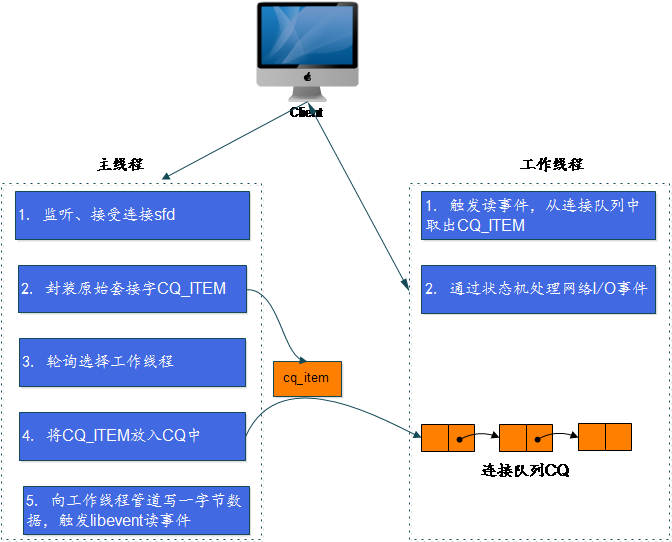

## memcached线程分析
徐顺 2013-08-20

memcached线程分析主要集中两个方面：  

* 线程的创建
* 线程的调度

memcached的线程池模型采用**Master-Worker**模型：

* 主线程负责监听、建立连接，并将其分发至工作线程处理；
* 工作线程处理该连接的读写事件。

### 核心数据结构  

CQ_ITEM是对原始套接字的封装，表示一个新的连接

	/* An item in the connection queue. */
	typedef struct conn_queue_item CQ_ITEM;
	struct conn_queue_item {
	    int               sfd;              /* 原始套接字 */
	    enum conn_states  init_state;       /* 初始状态 */
	    int               event_flags;      /* 事件标志 */
	    int               read_buffer_size; /* 读缓冲区大小 */
	    enum network_transport     transport;
	    CQ_ITEM          *next;
	};

CQ连接队列，一工作线程一队列  

	/* CQ_ITEM队列 */
	typedef struct conn_queue CQ;
	struct conn_queue {
	    CQ_ITEM *head;
	    CQ_ITEM *tail;
	    pthread_mutex_t lock;
	    pthread_cond_t  cond;
	};

主线程和工作线程结构

	/* 主线程结构体 */
	typedef struct {
	    pthread_t thread_id;        /* 线程ID */
	    struct event_base *base;    /* libevent的实例event_base */
	} LIBEVENT_DISPATCHER_THREAD;

	/* 每个工作线程包含一个libevent的实例event_base、一对读写管道pipe 、 一个连接队列 */
	typedef struct {
	    pthread_t thread_id;        /* 线程ID */
	    struct event_base *base;    /* 此线程的libevent句柄 */
	    struct event notify_event;  /* 此事件对象与下面的notify_receive_fd描述符关联，主线程通过此事件通知工作线程有新连接的到来 */
	    int notify_receive_fd;      /* 与main thread通信的管道(pipe)的接收端描述符 */
	    int notify_send_fd;         /* 与main thread通信的管道(pipe)的发送端描述符*/
	    struct thread_stats stats;  /* 线程相关的统计/状态信息 */
	    struct conn_queue *new_conn_queue; /* 连接队列，由主线程添加，等待工作线程处理 */
	    cache_t *suffix_cache;      /* 后缀缓存 */
	    uint8_t item_lock_type;     /* 锁 */
	} LIBEVENT_THREAD;

网络连接

	/**
	 * 对网络连接的封装
	 * memcached主要通过设置/转换连接的不同状态，来处理事件(核心函数是drive_machine)
	 */
	typedef struct conn conn;
	struct conn {
	    int    sfd;
	    sasl_conn_t *sasl_conn;
	    enum conn_states  state; /* 此连接状态，用于标记此连接在运行过程中的各个状态,其取值范围由conn_states枚举定义。      */
	    struct event event;
	    short  ev_flags;
	    short  which;   /** 哪个事件被触发 */
	    LIBEVENT_THREAD *thread; /* 服务此连接的工作线程 */
	    ....
	};